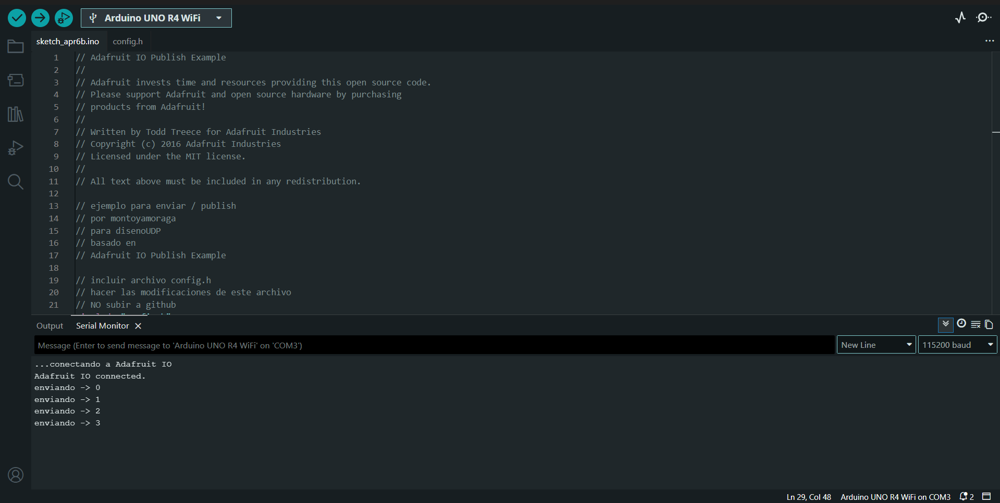

# sesion-05

lunes 06 abril 2026

solemne 1

hardware es físico y tangible se puede tocar como el cpu o el monitor

software es intangible y lógico como programas o apps como microsoft o windows

instalar adafruit io arduino, se encuentra en el library manager de arduino ide, intalar todo lo que pide si o si

pasos: new file, copiar código de discord, new tab nombre config.h, abre github copia confi.h que está en solemne 1/grupo 11/enviar/config.h y cópialo en arduino

hoy logramos, junto a anays cornejo, encender y apagar desde mi ipad el led que viene integrado en el arduino uno r4 wifi mediante el codigo que generamos para la solemne , esos resultadoes estaran en la carpeta de la solemne

tambien, siguiendo las intrucciones de el profe aaron, logramos enviar aal feed del profe el conteo que estaba el la carpeta codigo de la solemne 1

